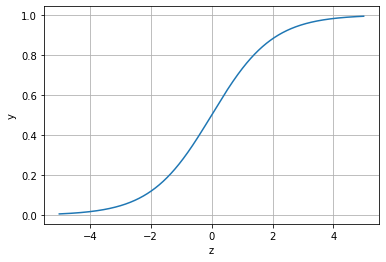
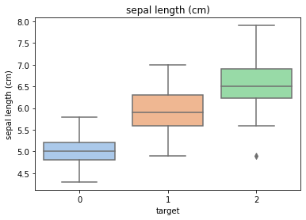
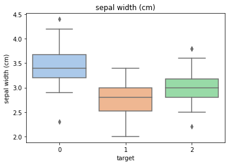
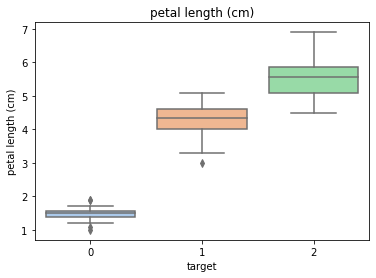
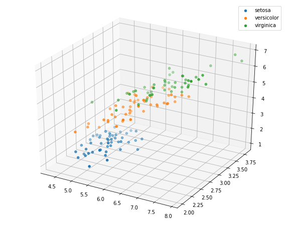
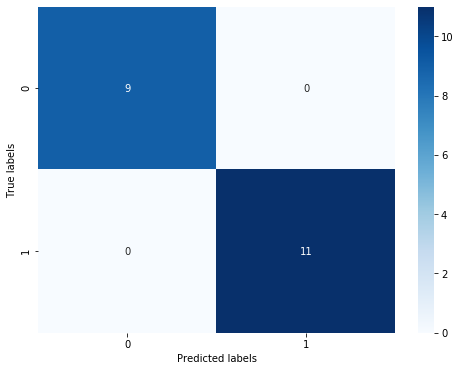
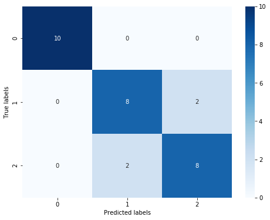

```python
#基于鸢尾花（iris）数据集的逻辑回归分类实践
#函数包的常见参数需要多熟悉
#数据分析流程仍然需要整理
```


```python
#sigmoid函数
import numpy as np
import matplotlib.pyplot as plt
x=np.arange(-5,5,0.01)
y=1/(1+np.exp(-x))
plt.plot(x,y)
plt.xlabel('z')
plt.ylabel('y')
plt.grid()
plt.show()
```





```python
#一：库函数导入
import numpy as np
import pandas as pd
import matplotlib.pyplot as plt
import seaborn as sns
```


```python
#二：数据读取载入(Iris数据为sklearn自带)
from sklearn.datasets import load_iris
#获取数据特征
data=load_iris()
#获取数据对应的标签（三种类别，0,1,2）
iris_target=data.target
#使用pandas将数据转化为Dataframe格式
#pandas.DataFrame( data, index, columns, dtype, copy)
iris_features=pd.DataFrame(data=data.data,columns=data.feature_names)
```


```python
#三：数据信息简单查看
#使用.info()查看数据整体信息，使用.head()和.tail()简单查看数据信息
iris_features.info()
```

    <class 'pandas.core.frame.DataFrame'>
    RangeIndex: 150 entries, 0 to 149
    Data columns (total 4 columns):
     #   Column             Non-Null Count  Dtype  
    ---  ------             --------------  -----  
     0   sepal length (cm)  150 non-null    float64
     1   sepal width (cm)   150 non-null    float64
     2   petal length (cm)  150 non-null    float64
     3   petal width (cm)   150 non-null    float64
    dtypes: float64(4)
    memory usage: 4.8 KB


```python
iris_features.head()
```


<div>
<style scoped>
    .dataframe tbody tr th:only-of-type {
        vertical-align: middle;
    }

    .dataframe tbody tr th {
        vertical-align: top;
    }

    .dataframe thead th {
        text-align: right;
    }
</style>
<table border="1" class="dataframe">
  <thead>
    <tr style="text-align: right;">
      <th></th>
      <th>sepal length (cm)</th>
      <th>sepal width (cm)</th>
      <th>petal length (cm)</th>
      <th>petal width (cm)</th>
    </tr>
  </thead>
  <tbody>
    <tr>
      <th>0</th>
      <td>5.1</td>
      <td>3.5</td>
      <td>1.4</td>
      <td>0.2</td>
    </tr>
    <tr>
      <th>1</th>
      <td>4.9</td>
      <td>3.0</td>
      <td>1.4</td>
      <td>0.2</td>
    </tr>
    <tr>
      <th>2</th>
      <td>4.7</td>
      <td>3.2</td>
      <td>1.3</td>
      <td>0.2</td>
    </tr>
    <tr>
      <th>3</th>
      <td>4.6</td>
      <td>3.1</td>
      <td>1.5</td>
      <td>0.2</td>
    </tr>
    <tr>
      <th>4</th>
      <td>5.0</td>
      <td>3.6</td>
      <td>1.4</td>
      <td>0.2</td>
    </tr>
  </tbody>
</table>
</div>


```python
iris_features.tail()
```


<div>
<style scoped>
    .dataframe tbody tr th:only-of-type {
        vertical-align: middle;
    }

    .dataframe tbody tr th {
        vertical-align: top;
    }

    .dataframe thead th {
        text-align: right;
    }
</style>
<table border="1" class="dataframe">
  <thead>
    <tr style="text-align: right;">
      <th></th>
      <th>sepal length (cm)</th>
      <th>sepal width (cm)</th>
      <th>petal length (cm)</th>
      <th>petal width (cm)</th>
    </tr>
  </thead>
  <tbody>
    <tr>
      <th>145</th>
      <td>6.7</td>
      <td>3.0</td>
      <td>5.2</td>
      <td>2.3</td>
    </tr>
    <tr>
      <th>146</th>
      <td>6.3</td>
      <td>2.5</td>
      <td>5.0</td>
      <td>1.9</td>
    </tr>
    <tr>
      <th>147</th>
      <td>6.5</td>
      <td>3.0</td>
      <td>5.2</td>
      <td>2.0</td>
    </tr>
    <tr>
      <th>148</th>
      <td>6.2</td>
      <td>3.4</td>
      <td>5.4</td>
      <td>2.3</td>
    </tr>
    <tr>
      <th>149</th>
      <td>5.9</td>
      <td>3.0</td>
      <td>5.1</td>
      <td>1.8</td>
    </tr>
  </tbody>
</table>
</div>


```python
#查看对应的类别标签
iris_target
```


    array([0, 0, 0, 0, 0, 0, 0, 0, 0, 0, 0, 0, 0, 0, 0, 0, 0, 0, 0, 0, 0, 0,
           0, 0, 0, 0, 0, 0, 0, 0, 0, 0, 0, 0, 0, 0, 0, 0, 0, 0, 0, 0, 0, 0,
           0, 0, 0, 0, 0, 0, 1, 1, 1, 1, 1, 1, 1, 1, 1, 1, 1, 1, 1, 1, 1, 1,
           1, 1, 1, 1, 1, 1, 1, 1, 1, 1, 1, 1, 1, 1, 1, 1, 1, 1, 1, 1, 1, 1,
           1, 1, 1, 1, 1, 1, 1, 1, 1, 1, 1, 1, 2, 2, 2, 2, 2, 2, 2, 2, 2, 2,
           2, 2, 2, 2, 2, 2, 2, 2, 2, 2, 2, 2, 2, 2, 2, 2, 2, 2, 2, 2, 2, 2,
           2, 2, 2, 2, 2, 2, 2, 2, 2, 2, 2, 2, 2, 2, 2, 2, 2, 2])


```python
#使用value_counts函数查看每个类别的数量
pd.Series(iris_target).value_counts()
```


    2    50
    1    50
    0    50
    dtype: int64


```python
#对特征进行统计描述
iris_features.describe()
```


<div>
<style scoped>
    .dataframe tbody tr th:only-of-type {
        vertical-align: middle;
    }

    .dataframe tbody tr th {
        vertical-align: top;
    }

    .dataframe thead th {
        text-align: right;
    }
</style>
<table border="1" class="dataframe">
  <thead>
    <tr style="text-align: right;">
      <th></th>
      <th>sepal length (cm)</th>
      <th>sepal width (cm)</th>
      <th>petal length (cm)</th>
      <th>petal width (cm)</th>
    </tr>
  </thead>
  <tbody>
    <tr>
      <th>count</th>
      <td>150.000000</td>
      <td>150.000000</td>
      <td>150.000000</td>
      <td>150.000000</td>
    </tr>
    <tr>
      <th>mean</th>
      <td>5.843333</td>
      <td>3.057333</td>
      <td>3.758000</td>
      <td>1.199333</td>
    </tr>
    <tr>
      <th>std</th>
      <td>0.828066</td>
      <td>0.435866</td>
      <td>1.765298</td>
      <td>0.762238</td>
    </tr>
    <tr>
      <th>min</th>
      <td>4.300000</td>
      <td>2.000000</td>
      <td>1.000000</td>
      <td>0.100000</td>
    </tr>
    <tr>
      <th>25%</th>
      <td>5.100000</td>
      <td>2.800000</td>
      <td>1.600000</td>
      <td>0.300000</td>
    </tr>
    <tr>
      <th>50%</th>
      <td>5.800000</td>
      <td>3.000000</td>
      <td>4.350000</td>
      <td>1.300000</td>
    </tr>
    <tr>
      <th>75%</th>
      <td>6.400000</td>
      <td>3.300000</td>
      <td>5.100000</td>
      <td>1.800000</td>
    </tr>
    <tr>
      <th>max</th>
      <td>7.900000</td>
      <td>4.400000</td>
      <td>6.900000</td>
      <td>2.500000</td>
    </tr>
  </tbody>
</table>
</div>


```python
#四：可视化描述
#合并标签和特征信息
#进行浅拷贝，保护原始数据完整性
iris_all=iris_features.copy()
iris_all['target']=iris_target
```


```python
#特征与标签组合的散点可视化
'''
seaborn.pairplot(data, hue=None, hue_order=None, 
                 palette=None, vars=None, x_vars=None,
                 y_vars=None, kind='scatter', diag_kind='auto', 
                 markers=None, height=2.5, aspect=1,
                 dropna=True,plot_kws=None, diag_kws=None,
                 grid_kws=None, size=None)
data: DataFrame

hue:变量名称
作用：用颜色将数据进行第二次分组

hue_order:字符串列表
作用：指定调色板中颜色变量的顺序

palette:调色板

vars:变量名列表

{x,y}_vars:变量名列表
作用：指定数据中变量分别用于图的行和列，

kind：{"scatter","reg"}
作用：指定数据之间的关系eg. kind="reg":指定数据的线性回归

diag_kind:{"auto","hist","kde"}
作用：指定对角线处子图的类型，默认值取决与是否使用hue。参考案例9和案例11

markers:标记

height:标量
作用：指定图的大小(图都是正方形的，所以只要指定height就行)

{plot，diag，grid} _kws：dicts字典
作用：指定关键字参数的字典
'''
sns.pairplot(data=iris_all,diag_kind='hist',hue='target')
plt.show()
```


```python
#从上图大概确定不同特征组合下的区分能力
'''
seaborn.boxplot(x=None, y=None, hue=None, data=None, order=None, hue_order=None, orient=None, color=None, 
palette=None, saturation=0.75, 
width=0.8, dodge=True, fliersize=5, linewidth=None, whis=1.5, notch=False, ax=None, **kwargs)
'''
#饱和度、颜色
for col in iris_features.columns:
    sns.boxplot(x='target',y=col,saturation=0.75,palette='pastel',data=iris_all)
    plt.title(col)
    plt.show()
```











```python
#利用箱型图得到不同类别在不同特征上的分布差异
#选取前三个特征绘制三维散点图
from mpl_toolkits.mplot3d import Axes3D
fig=plt.figure(figsize=(10,8))
ax=fig.add_subplot(111,projection='3d')

iris_all_class0=iris_all[iris_all['target']==0].values
iris_all_class1=iris_all[iris_all['target']==1].values
iris_all_class2=iris_all[iris_all['target']==2].values

ax.scatter(iris_all_class0[:,0],iris_all_class1[:,1],iris_all_class0[:,2],label='setosa')
ax.scatter(iris_all_class1[:,0],iris_all_class1[:,1],iris_all_class1[:,2],label='versicolor')
ax.scatter(iris_all_class2[:,0],iris_all_class2[:,1],iris_all_class2[:,2],label='virginica')
plt.legend()#加图例
plt.show()
```





```python
#利用逻辑回归模型
#进行二分类训练与预测
from sklearn.model_selection import train_test_split
#选择0和1的类别
iris_features_part=iris_features.iloc[:100]
iris_target_part=iris_target[:100]

x_train,x_test,y_train,y_test=train_test_split(iris_features_part,iris_target_part,test_size=0.2,random_state=2020)
from sklearn.linear_model import LogisticRegression
clf=LogisticRegression(random_state=0,solver='lbfgs')
clf.fit(x_train,y_train)
```


    LogisticRegression(C=1.0, class_weight=None, dual=False, fit_intercept=True,
                       intercept_scaling=1, l1_ratio=None, max_iter=100,
                       multi_class='auto', n_jobs=None, penalty='l2',
                       random_state=0, solver='lbfgs', tol=0.0001, verbose=0,
                       warm_start=False)


```python
print('The weight of Logistic Regression:',clf.coef_)
print('The intercept(w0) of Logistic Regression:',clf.intercept_)
```

    The weight of Logistic Regression: [[ 0.45181973 -0.81743611  2.14470304  0.89838607]]
    The intercept(w0) of Logistic Regression: [-6.53367714]


```python
#在训练集和测试集上进行模型预测
train_predict=clf.predict(x_train)
test_predict=clf.predict(x_test)
from sklearn import metrics

print('The accuracy of the Logistic Regression is:',metrics.accuracy_score(y_train,train_predict))
print('The accuracy of the Logistic Regression is:',metrics.accuracy_score(y_test,test_predict))

#查看混淆矩阵
confusion_matrix_result=metrics.confusion_matrix(test_predict,y_test)
print('The confusion matrix result:\n',confusion_matrix_result)

#利用热力图对结果进行可视化
plt.figure(figsize=(8,6))
sns.heatmap(confusion_matrix_result,annot=True,cmap='Blues')
plt.xlabel('Predicted labels')
plt.ylabel('True labels')
plt.show()
```

    The accuracy of the Logistic Regression is: 1.0
    The accuracy of the Logistic Regression is: 1.0
    The confusion matrix result:
     [[ 9  0]
     [ 0 11]]





```python
#利用逻辑回归模型进行多分类训练与预测
x_train,x_test,y_train,y_test=train_test_split(iris_features,iris_target,test_size=0.2,random_state=2020)
clf=LogisticRegression(random_state=0,solver='lbfgs')
clf.fit(x_train,y_train)
```


    LogisticRegression(C=1.0, class_weight=None, dual=False, fit_intercept=True,
                       intercept_scaling=1, l1_ratio=None, max_iter=100,
                       multi_class='auto', n_jobs=None, penalty='l2',
                       random_state=0, solver='lbfgs', tol=0.0001, verbose=0,
                       warm_start=False)


```python
print('The weight of Logistic Regression:',clf.coef_)
print('The intercept(w0) of Logistic Regression:',clf.intercept_)
```

    The weight of Logistic Regression: [[-0.45928925  0.83069887 -2.26606531 -0.99743981]
     [ 0.33117319 -0.72863424 -0.06841147 -0.9871103 ]
     [ 0.12811606 -0.10206464  2.33447678  1.98455011]]
    The intercept(w0) of Logistic Regression: [  9.4388067    3.93047364 -13.36928034]


```python
train_predict=clf.predict(x_train)
test_predict=clf.predict(x_test)
#利用predict_proba函数预测概率
train_predict_proba=clf.predict_proba(x_train)
test_predict_proba=clf.predict_proba(x_test)

print('The test predict Probability of each class:\n',test_predict_proba)

print('The accuracy of the Logistic Regression is:',metrics.accuracy_score(y_train,train_predict))
print('The accuracy of the Logistic Regression is:',metrics.accuracy_score(y_test,test_predict))
```

    The test predict Probability of each class:
     [[1.03461737e-05 2.33279477e-02 9.76661706e-01]
     [9.69926591e-01 3.00732874e-02 1.21677000e-07]
     [2.09992549e-02 8.69156616e-01 1.09844129e-01]
     [3.61934872e-03 7.91979966e-01 2.04400686e-01]
     [7.90943208e-03 8.00605299e-01 1.91485269e-01]
     [7.30034956e-04 6.60508053e-01 3.38761912e-01]
     [1.68614210e-04 1.86322045e-01 8.13509341e-01]
     [1.06915331e-01 8.90815532e-01 2.26913671e-03]
     [9.46928071e-01 5.30707288e-02 1.20016059e-06]
     [9.62346385e-01 3.76532228e-02 3.91897297e-07]
     [1.19533386e-04 1.38823469e-01 8.61056998e-01]
     [8.78881880e-03 6.97207359e-01 2.94003822e-01]
     [9.73938143e-01 2.60617342e-02 1.22613839e-07]
     [1.78434056e-03 4.79518177e-01 5.18697483e-01]
     [5.56924345e-04 2.46776840e-01 7.52666235e-01]
     [9.83549842e-01 1.64500666e-02 9.13617271e-08]
     [1.65201476e-02 9.54672748e-01 2.88071040e-02]
     [8.99853722e-03 7.82707575e-01 2.08293888e-01]
     [2.98015029e-05 5.45900069e-02 9.45380192e-01]
     [9.35695863e-01 6.43039522e-02 1.85301368e-07]
     [9.80621190e-01 1.93787398e-02 7.00125265e-08]
     [1.68478817e-04 3.30167227e-01 6.69664294e-01]
     [3.54046168e-03 4.02267804e-01 5.94191734e-01]
     [9.70617284e-01 2.93824736e-02 2.42443971e-07]
     [2.56895209e-04 1.54631583e-01 8.45111521e-01]
     [3.48668493e-02 9.11966140e-01 5.31670110e-02]
     [1.47218849e-02 6.84038113e-01 3.01240002e-01]
     [9.46510459e-04 4.28641987e-01 5.70411502e-01]
     [9.64848137e-01 3.51516747e-02 1.87917886e-07]
     [9.70436779e-01 2.95624021e-02 8.18591621e-07]]
    The accuracy of the Logistic Regression is: 0.9833333333333333
    The accuracy of the Logistic Regression is: 0.8666666666666667


```python
confusion_matrix_result=metrics.confusion_matrix(test_predict,y_test)
print('The confusion matrix result:\n',confusion_matrix_result)

#利用热力图对结果进行可视化
#annot为True意思是在方格内写入数据
plt.figure(figsize=(8,6))
sns.heatmap(confusion_matrix_result,annot=True,cmap='Blues')
plt.xlabel('Predicted labels')
plt.ylabel('True labels')
plt.show()
```

    The confusion matrix result:
     [[10  0  0]
     [ 0  8  2]
     [ 0  2  8]]





```python
#1，2类特征不够明显，导致分类错误的发生
```


```python

```


```python

```


```python

```


```python

```


```python

```


```python

```


```python

```


```python

```


```python

```


```python

```


```python

```


```python

```


```python

```


```python

```


```python

```


```python

```


```python

```


```python

```


```python

```


```python

```
